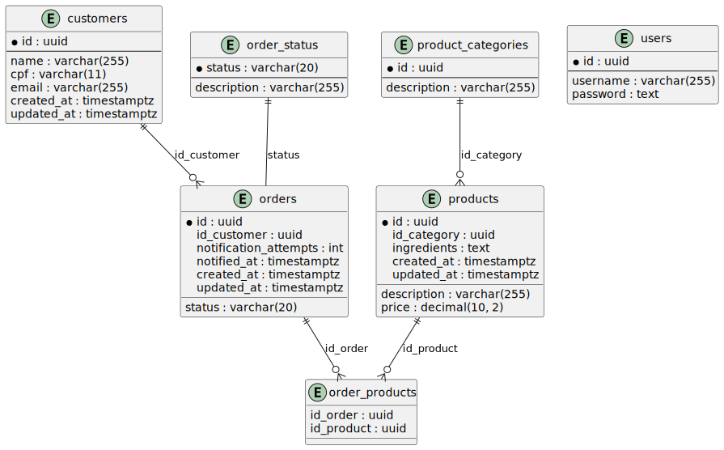

# Backstage Food - Tech Challenge - Sistema de Autoatendimento para Lanchonete

## Descrição do Projeto

Este projeto foi desenvolvido como parte de um desafio técnico para implementação de um sistema de autoatendimento para uma lanchonete de bairro em expansão.
O objetivo é centralizar e automatizar o controle de pedidos, desde a seleção dos produtos até o acompanhamento do status de preparação, melhorando a eficiência e a satisfação do cliente.

O sistema é desenvolvido utilizando a linguagem de programação **GO** e o banco de dados **PostgreSQL**, com arquitetura hexagonal e padrões DDD. 
A aplicação é somente backend e possui documentação da API no swagger.

## Documentação do sistema
A documentação do sistema (DDD) com Event Storming, incluindo todos os passos/tipos de diagrama mostrados na aula 6 do módulo de DDD, está disponível neste endereço do [miro](https://miro.com/app/board/uXjVKg5JFS0=/).

### Modelagem no banco de dados


### Estrutura do projeto
```
├── cmd   
    └── app   
        └── main.go   
├── internal   
   ├── core
      ├── domain
         ├── customer.go
         ├── order.go
         ├── product_category.go
         └── product.go
      ├── ports
         ├── repositories
            ├── customer.go
            ├── order.go
            └── product.go
         └── services
             ├── customer.go
             ├── order.go
             └── product.go
      └── services
          ├── customer.go
          ├── order.go
          ├── payment_gateway
             └── fake_checkout.go
          └── product.go
   ├── handlers
      ├── customer.go
      ├── handlers.go
      ├── order.go
      └── product.go
   ├── repositories
      ├── customers.go
      ├── orders.go
      ├── postgres.go
      └── products.go
   └── routes
       └── routes.go
├── pkg
   ├── cpf
      ├── cpf.go
      └── utils.go
   └── transaction
       └── transaction.go
```

## Configuração e Execução

1. **Pré-requisitos**
  - **Docker** e **Docker Compose** instalados.

2. **Clonar o Repositório**
   ```bash
   git clone https://github.com/backstagefood/backstagefood.git
   cd backstagefood

3. **Criar arquivo .env na raiz do projeto ou executar o comando `make setup-env`**
   ```.env
   DB_USER=backstage
   DB_PASS=backstage
   DB_NAME=backstage
   SERVER_PORT=8080
   DB_DRIVER=postgres
   DB_HOST=db:5432
   
4. **Executar o projeto utilizando docker compose ou executar o comando `make up`** 
   ```bash
   docker compose up --build -d

5. **Acessar a documentação da API(swagger) neste [link](http://localhost:8080/swagger/index.html)**


